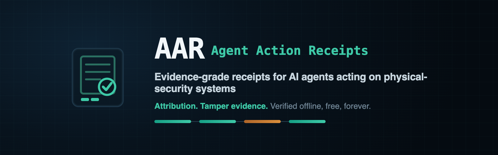

# Agent Action Receipts (AAR)

### Vendor-neutral, evidence-grade conformance profiles for AI agents acting on physical-security systems.

  
  
  
  
  
  

<a href="spec/aar-core.cddl">Normative CDDL</a> ·
<a href="docs/threat-model-v0.1.md">Threat model</a> ·
<a href="pyref/">Offline verifier</a> ·
<a href="docs/rfp-language-v0.2.md">RFP language</a> ·
<a href="https://github.com/oneshot2001/onvif-mcp">Reference producer</a> ·
<a href="https://github.com/oneshot2001/aar/issues">Report an issue</a>

---

## The question AAR answers

*What must be independently provable about what an agent saw, inferred, was
authorized to do, and actually did — before its output triggers physical-world
action or becomes evidence?*

## Status

| Artifact | State |
|---|---|
| Requirements draft | **v0.1.1** — `docs/spec-v0.1.1-requirements-draft.md` |
| Threat model | **v0.1** — `docs/threat-model-v0.1.md` (30-finding adversarially challenged, gated) |
| v0.2 wire | **v0.2-rc7** — normative CDDL at `spec/aar-core.cddl`; five rc gates closed, exit bar re-run live against real cameras |
| Offline verifier | **pyref** — clean-room, Python stdlib only, no network, no wall clock: `python -m pyref verify BUNDLE.cbor --at T --trust-policy POLICY.json` |
| Conformance KATs | byte-pinned positive / negative / class-boundary / terminal-state fixtures in `kats/`, generated by an independent TypeScript harness |
| Adapters | VAPIX live leg + one VMS control leg exercised at gate 5 (`adapters/`) |
| First reference producer | [onvif-mcp](https://github.com/oneshot2001/onvif-mcp) — governed MCP server for cameras; AAR-vocabulary receipts today, wire conformance in progress |

v0.2 is a release candidate, not a frozen standard: the wire may still change
in response to public review. That review is the point of publishing.

## Guarantees (and honest non-guarantees)

AAR provides **attribution**, **post-emission tamper evidence**, and **tamper
evidence over producer-declared epoch contents** (completeness is
census/reconciliation-conditional). It does **not** stop a compromised signer
lying before emission, prove any inference correct, or establish legal
compliance — see the threat model's residual-risk register for the complete
honest list.

## Layout

- `docs/` — governing documents (spec, threat model, wire rubric, RFP model language, related work)
- `spec/` — normative CDDL + prose, gate records (v0.2 work product)
- `kats/` — byte-pinned known-answer tests + negative fixtures
- `harness/` — KAT generator + cross-verification harness (TypeScript)
- `pyref/` — free offline verifier (Python 3.11+, stdlib only)
- `adapters/` — VAPIX + VMS reference legs
- `demo/` — sanitized end-to-end run evidence

## Process

Two-model pipeline: Claude plans and gates (CDDL review → KAT coverage audit →
adversarial rc review); Codex builds. Wire discipline inherited from
edgeproof-sdr v1.1 (deterministic CBOR, closed schemas, COSE_Sign1 ES256,
strict first-failure, externally generated KATs). The gate records are
published in `spec/` deliberately — scrutiny is the hardening.

## License

- **Code** (`pyref/`, `harness/`, `kats/`, `adapters/`, `demo/`): Apache License 2.0 — see `LICENSE`.
- **Specification text** (`spec/`, `docs/` prose and CDDL): CC BY 4.0 — see `LICENSE-SPEC`.

Verifying receipts is free, forever, offline, with no account and no license
from anyone. That property is load-bearing: an evidence format you cannot
independently check is not an evidence format.
